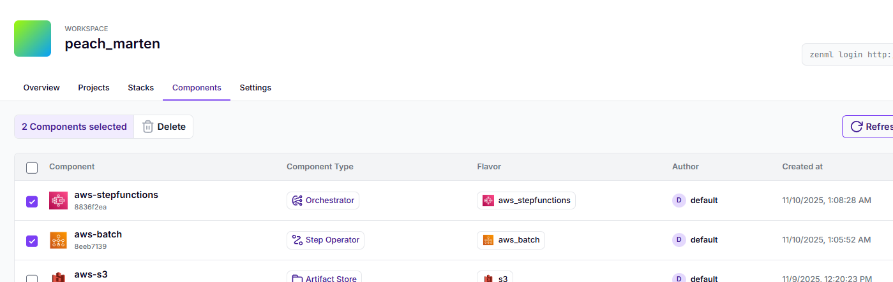
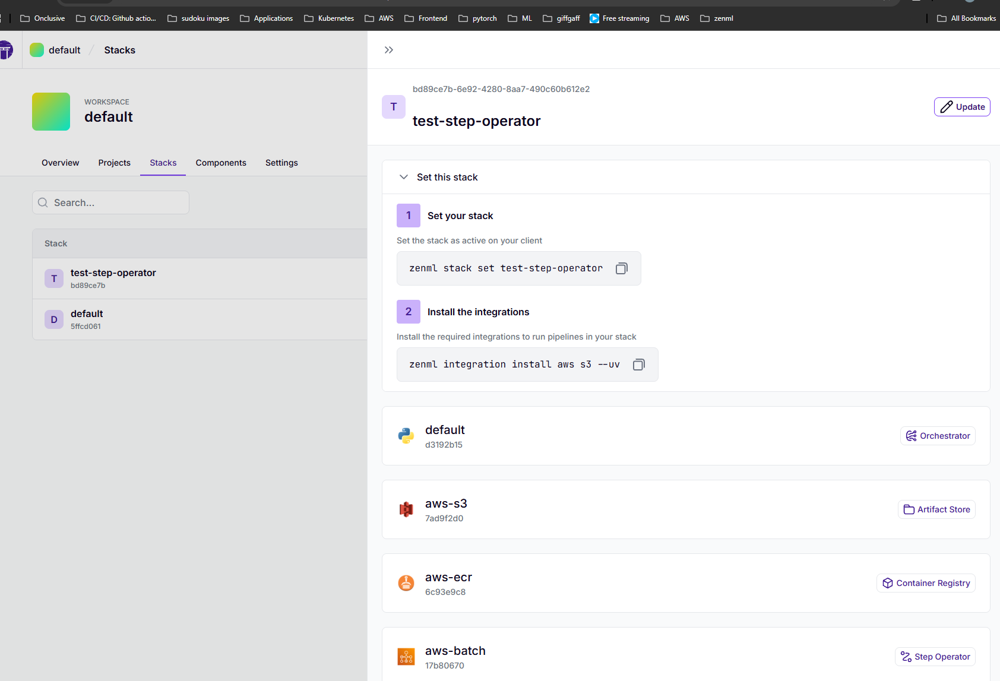
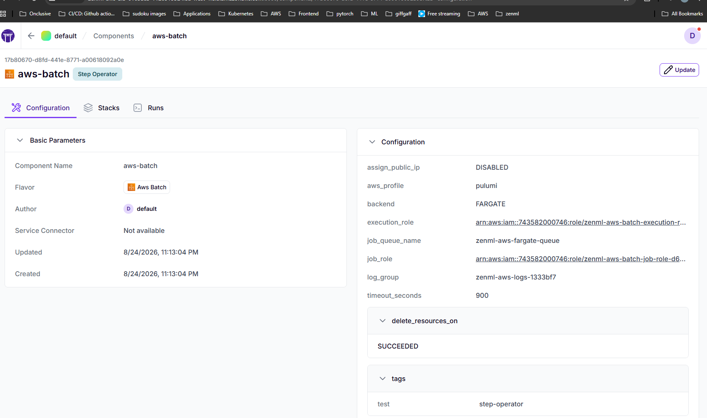
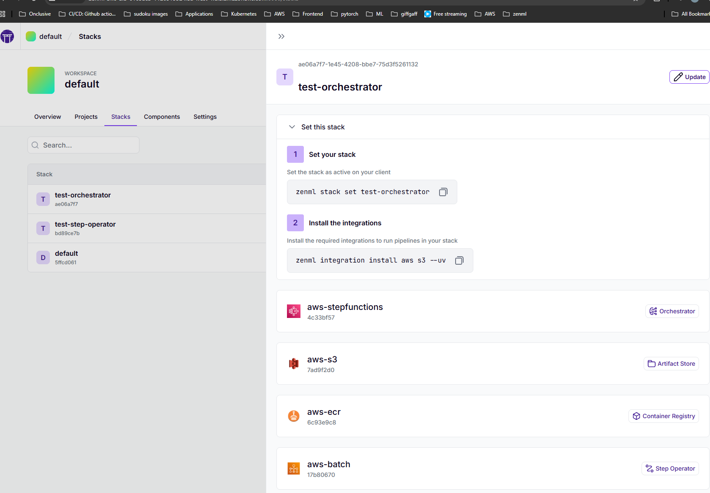
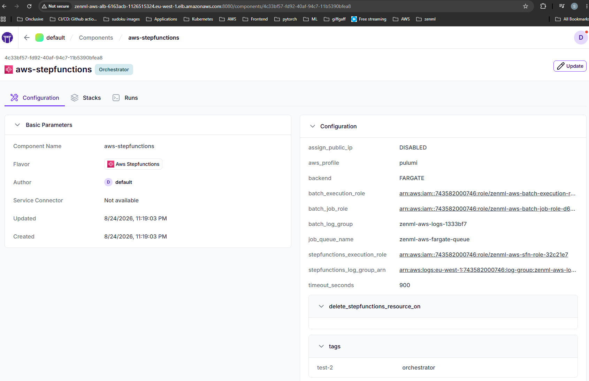
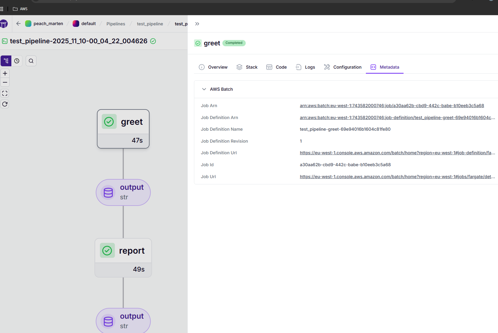
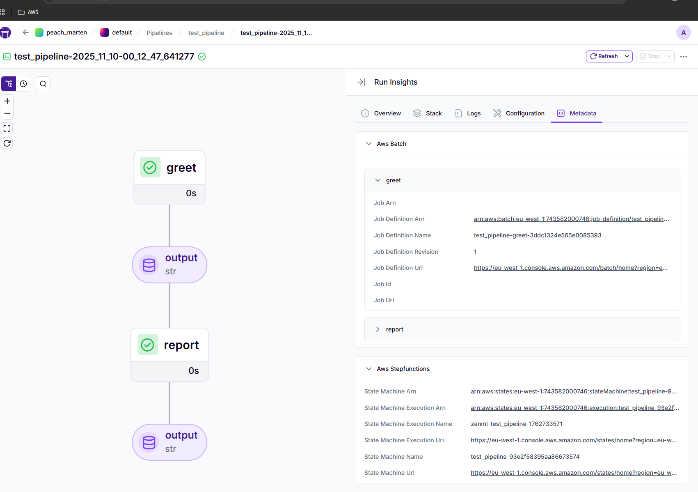

# Overview

This repository implements a collection of AWS integrations for the zenml
platform.

Contains:

- a customized version of [the AWS Batch step operator proposed in this PR in the official zenml repository](https://github.com/zenml-io/zenml/pull/3954) (based on [this original plugin implementation](https://github.com/zenml-io/zenml-plugins/blob/41f9f9bc91e4fa25cf90068bc2db8a8a721b5986/step_operator_batch/step_operator/aws_batch_step_operator.py#L47))
- a placeholder for a future AWS Batch EC2 (and thus GPU) compatible extension of [the great ML Ops Club's step functions orchestrator implementation](https://github.com/mlops-club/zenml-aws-stepfunctions-orchestrator/blob/a9179570d03d44b674031699ac9bbe943bc25fa8/sfn-orchestrator/src/sfn_orchestrator/sfn_orchestrator.py#L175)



## Setup

Use the included devcontainer specs to spin up the devcontainer in VS Code.

As seen in the `.devcontainer/devcontainer.json` configuration, it relies on an
 AWS profile called `pulumi`, and a credentials file linked to said profile:

 ```json
 ...
   "remoteEnv": {
    "AWS_PROFILE": "pulumi",
    "AWS_REGION": "eu-west-1",
    "AWS_PAGER": "",
  },
  "mounts": [
    "source=${localEnv:USERPROFILE}/.aws,target=/root/.aws,type=bind",
    "source=.metaflowconfig,target=/root/.metaflowconfig,type=bind"
  ],
...
```

## Infrastructure

Provision the pulumi stack in the AWS cloud, including a publically available
RDS sql server for the remote zenml store. This needs to be run by an AWS
identity that has the required pulumi provisioning permissions. My local setup
achieves this by a designated `PulumiDevRole` holding all the required policies
and/or permissions, and that can be assumed by a 
`pululmi-bootstrap` User. I've configured this setup using the below 
configuration files `~/.aws/config` and `~/.aws/credentials`: 

```conf
[profile pulumi] # ~/.aws/config
role_arn = arn:aws:iam::743582000746:role/PulumiDevRole
source_profile = pulumi-bootstrap
region = eu-west-1
```

```conf
[pulumi-bootstrap] # ~/.aws/credentials
aws_access_key_id = <AWS_ACCESS_KEY_ID>
aws_secret_access_key = <AWS_SECRET_ACCESS_KEY>
```


```bash
export AWS_PROFILE=pulumi # 'set AWS_PROFILE=pulumi' on windows
cd infrastructure
pulumi up -y
```

The run

```bash
source export-pulumi-outputs.sh
```

This will export the pulumi stack outputs to environment variables.

## Docker image

> [!NOTE]
> You will need to run this section outside of the dev container as it does
> not currently support the building of docker images

To authenticate your local docker client with the remote ECR stack you just
provisioned, run:

```bash
aws ecr get-login-password --region ${AWS_REGION} | docker login --username AWS --password-stdin ${ECR_REGISTRY_URI}
```

To build a zenml docker image that can run remotely, run:

```bash
docker build -f infrastructure\docker\component\Dockerfile . -t ${ECR_REPOSITORY_URL}:latest
docker push ${ECR_REPOSITORY_URL}:latest
```

## Zenml `step-operator` and `orchestrator` test stack

Create a `zenml` stack using this library's integrations by running the following
commands.

Login with the remote SQL zenml store directly:

```bash
zenml login ${SERVER_EXTERNAL_URL}
```

Register the git repository as a local zenml repository:

```bash
zenml init
```

The username is `default`, and the password is the key `default_user_password` from the `zenml-aws-server-secret-...` secret

Register a remote type ECR contaier registry component:

```bash
zenml container-registry register aws-ecr -f aws --uri=${ECR_REGISTRY_URI}
```

Register a remote type S3 artifact store component:

```bash
zenml artifact-store register aws-s3 -f s3 --path=${ARTIFACT_STORE_S3_BUCKET}
```

### Batch Step Operator

To register a `test-step-operator` zenml stack containing
- an `s3` flavour artifact store component `aws-s3`
- an `aws` flavour container registry component `aws`
- a `aws_batch` flavour step operator component `aws-batch`
- the `default` flavour orchestrator component

run:

```bash
zenml step-operator flavor register zenml_aws.flavors.aws_batch_step_operator_flavor.AWSBatchStepOperatorFlavor
zenml step-operator register aws-batch -f aws_batch --execution_role=${BATCH_EXECUTION_ROLE_ARN} --job_role=${BATCH_JOB_ROLE_ARN} --job_queue_name=${BATCH_DEFAULT_JOB_QUEUE_NAME} --backend=FARGATE --tags="{\"test\": \"step-operator\"}" --timeout_seconds=900 --delete_resources_on="[\"SUCCEEDED\"]" --log_group=${LOG_GROUP_NAME} --aws_region=${AWS_REGION}
zenml stack register test-step-operator -o default -c aws-ecr -s aws-batch -a aws-s3
zenml stack set test-step-operator
```





To remove this stack, remove the step operator component and unregister the
 `aws_batch` step operator flavour, run

```bash
zenml stack set default
zenml stack delete test-step-operator -y
zenml step-operator delete aws-batch
zenml step-operator flavor delete aws_batch
```

### Stepfunctions Orchestrator

To register a `test-orchestrator` zenml stack containing
- an `s3` flavour artifact store component `aws-s3`
- an `aws` flavour container registry component `aws`
- a `aws_batch` flavour step operator component `aws-batch`
- a `aws_stepfunctions` flavour orchestrator component `aws-stepfunctions`,

run:

```bash
zenml orchestrator flavor register zenml_aws.flavors.aws_stepfunctions_batch_orchestrator_flavor.AWSStepFunctionsOrchestratorFlavor
zenml orchestrator register aws-stepfunctions -f aws_stepfunctions --stepfunctions_execution_role=${SFN_EXECUTION_ROLE_ARN} --batch_execution_role=${BATCH_EXECUTION_ROLE_ARN} --batch_job_role=${BATCH_JOB_ROLE_ARN} --job_queue_name=${BATCH_DEFAULT_JOB_QUEUE_NAME} --backend=FARGATE --tags="{\"test-2\": \"orchestrator\"}" --timeout_seconds=900 --delete_stepfunctions_resource_on="[]" --batch_log_group=${LOG_GROUP_NAME} --stepfunctions_log_group_arn=${LOG_GROUP_ARN} --aws_region=${AWS_REGION}
zenml stack register test-orchestrator -o aws-stepfunctions -c aws-ecr -a aws-s3
zenml stack set test-orchestrator
```





To remove this stack, remove the step operator and orchestrator components and
 unregister the `aws_batch` step operator flavour and the `aws_stepfunctions`
  orchestrator flavour, run

```bash
zenml stack set default
zenml stack delete test-orchestrator -y
zenml orchestrator delete aws-stepfunctions
zenml orchestrator flavor delete aws_stepfunctions
```

## Tests

For local only unit and integration tests, simply run the pytest test suites
in the respective directories:

```bash
pytest tests/unit -vv # unit tests
pytest tests/integration -vv # integration tests
```

For end-to-end testing of the `aws_batch` flavour step-operator on the provisioned AWS infrastructure, run the 
test scripts in the `scripts` directory:

```bash
zenml stack set test-step-operator
python scripts/test_run_step_operator.py --backend FARGATE --job-queue zenml-aws-fargate-queue --memory 2048
python scripts/test_run_step_operator.py --backend EC2 --job-queue zenml-aws-ec2-queue --memory 1000
python scripts/test_run_step_operator.py --backend EC2 --job-queue zenml-aws-ec2-queue --memory 1000 --gpu 1

```



For end-to-end testing of the `aws_stepfunctions` orchestrator on the provisioned AWS infrastructure, run the test scripts in the `scripts` directory:

```bash
zenml stack set test-orchestrator
python scripts/test_run_orchestrator.py --backend FARGATE --job-queue zenml-aws-fargate-queue --memory 2048
python scripts/test_run_orchestrator.py --backend EC2 --job-queue zenml-aws-ec2-queue --memory 1000
python scripts/test_run_orchestrator.py --backend EC2 --job-queue zenml-aws-ec2-queue --memory 1000 --gpu 1
```

